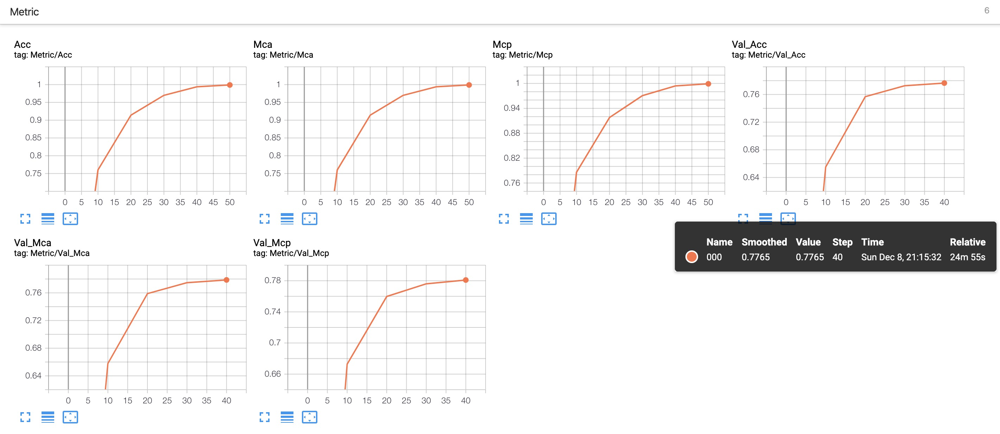

# BASELINE

***

This repo contains some baseline for public datasets.

### Requirement

* Cuda 9.2+ or 10.1+
* Package installed requirement.txt

```bash
pip install requirement.txt
```

### Directory

Your directory should look like below after **git clone**.  

```
.
├── data
├── requirement.txt
├── saved
├── scripts
├── src
└── tags
```

Create directory **models** and directory **logdirs** under **saved** directory.

### Run

Run your scripts in root directory.

```bash
bash ./scripts/CUB_000.sh
```

### Logs

You can observe logs in three ways

* Standard output.
* **tail -f ** Logs file, eg. **tail -f 000.log** under saved/logdirs/000/
* Tensorboard, which also placed under saved/logdirs/000/

### Outputs

